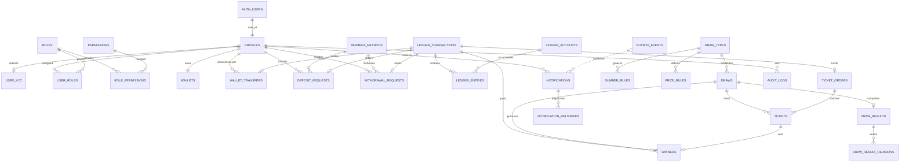

# TRADEX Database Architecture & Production Specification

**Version:** 1.0.0-PROD  
**Database Engine:** Supabase PostgreSQL 15+ / PostgreSQL Standard  
**Financial Engine:** Immutable Double-Entry Ledger  
**Primary Currency:** Bangladeshi Taka (`BDT`), stored strictly as integer minor units (paisa)  
**Authentication Identity:** Supabase Auth (`auth.users(id)` UUID)  
**Media Metadata Storage:** Cloudinary references in PostgreSQL (no binary blobs)  
**Cache Layer:** Redis (read cache and rate limits only; never financial truth)  

---

## 1. Executive Summary & Architectural Principles

The TRADEX database architecture serves as the permanent, authoritative source of truth for all business, lottery, and financial states. Every schema decision adheres to six core pillars:

1. **Financial Correctness Over Convenience:**  
   No monetary transaction occurs without balanced, immutable double-entry ledger entries. Total sum across any finalized transaction's entries must equal zero: $\sum \text{amount\_minor} = 0$.
2. **Strict Minor Units Storage:**  
   Floating-point types (`FLOAT`, `REAL`, `DOUBLE PRECISION`, `NUMERIC`) are prohibited for authoritative financial balances. All currency amounts are stored as 64-bit integers (`BIGINT`) representing minor units (1 BDT = 100 paisa).
3. **Defense in Depth with Relational Invariants:**  
   Business constraints are enforced directly in PostgreSQL via `CHECK` constraints, foreign keys with explicit `ON DELETE RESTRICT` rules, and deferred constraint triggers.
4. **Leading-Zero Preservation:**  
   Lottery numbers (e.g. `0012345` for Mega 7-digit, `007` for Daily 3-digit) are strictly modeled as character sequences (`VARCHAR`) with digit regex validation, never as integers.
5. **Deterministic Concurrency & Deadlock Prevention:**  
   Financial balance mutations utilize `SELECT ... FOR UPDATE` row locks. Multi-account operations (such as user-to-user transfers) sort lock acquisitions deterministically by `user_id` or `wallet_id` ascending.
6. **Optimized Row-Level Security (RLS) & Indexing:**  
   All public tables enforce RLS. Per-row policy evaluation overhead is eliminated by caching the auth identity via `(select auth.uid())`. 100% of foreign keys and critical queue states have dedicated indexes.

---

## 2. Entity-Relationship Diagram (ERD)



---

## 3. Ordered Migration Manifest

All database schema evolutions are managed as strict, forward-only SQL migrations located in `backend/migrations`:

| Migration File | Domain | Primary Objects Created |
| :--- | :--- | :--- |
| `000001_core_profiles_auth.sql` | Auth & Identity | `media_assets`, `profiles`, `user_kyc`, `set_updated_at()` trigger |
| `000002_rbac_roles_permissions.sql` | Access Control | `roles`, `permissions`, `role_permissions`, `user_roles`, deterministic system seeds |
| `000003_wallets_double_entry_ledger.sql` | Financial Core | `wallets`, `ledger_accounts`, `ledger_transactions`, `ledger_entries`, `idempotency_keys`, balance invariant trigger |
| `000004_payment_methods_deposits_withdrawals.sql` | Banking & Transfers | `payment_methods`, `deposit_requests`, `withdrawal_requests`, `wallet_transfers`, payment seed |
| `000005_draws_tickets_results_winners.sql` | Lottery Core | `draw_types`, `draws`, `number_rules`, `prize_rules`, `draw_prize_rules`, `ticket_orders`, `tickets`, `draw_results`, `draw_result_revisions`, `winners` |
| `000006_notifications_banners_audit_outbox.sql` | Ops & Async Core | `notifications`, `notification_deliveries`, `banners`, `promo_banners` view, `audit_logs`, `outbox_events` |
| `000007_rls_and_indexes.sql` | Security & Speed | Public tables RLS enablement, `service_role` full access, user row policies, partial queue indexes |

---

## 4. Comprehensive Table Catalog

### 4.1 Core Identity & Profiles

#### `profiles`
Extends `auth.users` with TRADEX domain data, contact details, and referral links.
* **`user_id`** (`UUID PRIMARY KEY`): References `auth.users(id) ON DELETE RESTRICT`.
* **`public_id`** (`UUID UNIQUE NOT NULL`): Publicly exposed identifier generated via `gen_random_uuid()`.
* **`username`** (`VARCHAR(100)`): Display username. Unique via functional lowercase index `lower(username)`.
* **`full_name`** (`VARCHAR(255)`): Legal name of user.
* **`phone`** (`VARCHAR(50)`): Normalized canonical E.164 phone number. Indexed.
* **`email`** (`VARCHAR(255)`): Cached email address. Indexed via `lower(email)`.
* **`avatar_asset_id`** (`BIGINT NULL`): References `media_assets(id) ON DELETE SET NULL`.
* **`status`** (`VARCHAR(50) NOT NULL DEFAULT 'ACTIVE'`): Enforced by `CHECK (status IN ('ACTIVE', 'SUSPENDED', 'BLOCKED', 'CLOSED'))`.
* **`kyc_status`** (`VARCHAR(50) NOT NULL DEFAULT 'NOT_SUBMITTED'`): `CHECK (kyc_status IN ('NOT_SUBMITTED', 'PENDING', 'VERIFIED', 'REJECTED'))`.
* **`role`** (`VARCHAR(50) NOT NULL DEFAULT 'USER'`): Quick role reference for backwards compatibility.
* **`referral_code`** (`VARCHAR(100) UNIQUE NULL`): Unique user referral string.
* **`referred_by`** (`UUID NULL`): Self-reference to `profiles(user_id) ON DELETE SET NULL`.
* **`created_at`** / **`updated_at`** (`TIMESTAMPTZ NOT NULL DEFAULT now()`): Managed by `trg_profiles_updated_at`.

#### `user_kyc`
Stores identity documents, verification proofs, and admin review actions.
* **`id`** (`BIGINT GENERATED ALWAYS AS IDENTITY PRIMARY KEY`)
* **`public_id`** (`UUID UNIQUE NOT NULL DEFAULT gen_random_uuid()`)
* **`user_id`** (`UUID UNIQUE NOT NULL`): References `profiles(user_id) ON DELETE RESTRICT`.
* **`status`** (`VARCHAR(50) NOT NULL DEFAULT 'PENDING'`): Enforced `NOT_SUBMITTED`, `PENDING`, `VERIFIED`, `REJECTED`.
* **`document_type`** (`VARCHAR(50) NOT NULL`): Enforced `NID`, `PASSPORT`, `DRIVING_LICENSE`, `OTHER`.
* **`document_number_masked`** (`VARCHAR(100) NOT NULL`): Masked document number (e.g. `******1234`).
* **`front_asset_id`** / **`back_asset_id`** / **`selfie_asset_id`** (`BIGINT NULL`): References `media_assets(id) ON DELETE RESTRICT`.
* **`reject_reason`** (`TEXT NULL`): Rejection notes if rejected.
* **`submitted_at`** (`TIMESTAMPTZ NOT NULL DEFAULT now()`)
* **`reviewed_at`** (`TIMESTAMPTZ NULL`), **`reviewed_by`** (`UUID NULL REFERENCES profiles(user_id)`).

#### `media_assets`
Authoritative metadata for media files hosted externally on Cloudinary.
* **`id`** (`BIGINT GENERATED ALWAYS AS IDENTITY PRIMARY KEY`)
* **`cloudinary_public_id`** (`VARCHAR(255) UNIQUE NOT NULL`): Cloudinary asset identifier.
* **`secure_url`** (`TEXT NOT NULL`): HTTPS delivery URL.
* **`resource_type`** (`VARCHAR(50) NOT NULL DEFAULT 'image'`)
* **`bytes`** (`BIGINT NULL`), **`width`** / **`height`** (`INTEGER NULL`), **`mime_type`** (`VARCHAR(100) NULL`).

---

### 4.2 RBAC (Roles & Permissions)

* **`roles`**: `id`, `code` (`VARCHAR(50) UNIQUE`), `name`, `description`, `is_system` (`BOOLEAN`).
  * System roles seeded: `SUPER_ADMIN`, `ADMIN`, `FINANCE_ADMIN`, `DRAW_MANAGER`, `SUPPORT`, `AGENT`, `USER`.
* **`permissions`**: `id`, `code` (`VARCHAR(100) UNIQUE`), `name`, `description`.
  * Standard permissions seeded: `users.view`, `users.manage`, `users.block`, `kyc.view`, `kyc.review`, `deposits.view`, `deposits.approve`, `deposits.reject`, `withdrawals.view`, `withdrawals.approve`, `withdrawals.reject`, `wallet.view`, `wallet.adjust`, `wallet.transfer`, `draws.view`, `draws.create`, `draws.manage`, `draws.execute`, `tickets.view`, `tickets.purchase`, `results.view`, `results.publish`, `winners.view`, `winners.process`, `settings.view`, `settings.manage`, `audit.view`, `reports.view`.
* **`role_permissions`**: `PRIMARY KEY (role_id, permission_id)` mapping roles to permissions with cascading deletes.
* **`user_roles`**: `PRIMARY KEY (user_id, role_id)` mapping users to assigned roles with `assigned_by` audit trail.

---

### 4.3 Wallets & Double-Entry Ledger

#### `wallets`
Fast read-optimized balance cache. Mutated ONLY within the same database transaction as matching ledger entries.
* **`id`** (`BIGINT GENERATED ALWAYS AS IDENTITY PRIMARY KEY`)
* **`public_id`** (`UUID UNIQUE NOT NULL DEFAULT gen_random_uuid()`)
* **`user_id`** (`UUID UNIQUE NOT NULL REFERENCES profiles(user_id) ON DELETE RESTRICT`)
* **`currency`** (`CHAR(3) NOT NULL DEFAULT 'BDT'`)
* **`available_balance_minor`** (`BIGINT NOT NULL DEFAULT 0 CHECK (available_balance_minor >= 0)`)
* **`locked_balance_minor`** (`BIGINT NOT NULL DEFAULT 0 CHECK (locked_balance_minor >= 0)`)
* **`version`** (`BIGINT NOT NULL DEFAULT 0`): Optimistic concurrency tracking counter.

#### `ledger_accounts`
Chart of accounts for internal accounting balances.
* **`id`** (`BIGINT GENERATED ALWAYS AS IDENTITY PRIMARY KEY`)
* **`owner_type`** (`VARCHAR(50) NOT NULL`): `'USER'` or `'SYSTEM'`.
* **`owner_id`** (`VARCHAR(255) NOT NULL`): User UUID string or `'SYSTEM'`.
* **`account_type`** (`VARCHAR(50) NOT NULL`):
  * `USER_AVAILABLE`: User funds ready for spending, transfers, or withdrawal.
  * `USER_LOCKED`: User funds held pending withdrawal approval.
  * `DEPOSIT_CLEARING`: System clearing account for external inbound funds.
  * `WITHDRAWAL_CLEARING`: System clearing account for external outbound funds.
  * `PLATFORM_REVENUE`: Platform gross margins, purchase receipts, and fees.
  * `PRIZE_POOL`: Provisioned prize liabilities for draw winners.
  * `BONUS_POOL`: Promotional incentives and credits.
  * `AGENT_COMMISSION`: Commissions payable to network agents.
  * `SYSTEM_ADJUSTMENT`: Offsetting account for administrative balance overrides.
* **`currency`** (`CHAR(3) NOT NULL DEFAULT 'BDT'`)
* **`status`** (`VARCHAR(50) NOT NULL DEFAULT 'ACTIVE' CHECK (status IN ('ACTIVE', 'FROZEN', 'CLOSED'))`)
* **Constraint:** `UNIQUE (owner_type, owner_id, account_type, currency)` guarantees exactly one ledger account per role/currency.

#### `ledger_transactions`
Atomic group of double-entry entries representing a single business event.
* **`id`** (`BIGINT GENERATED ALWAYS AS IDENTITY PRIMARY KEY`)
* **`transaction_type`** (`VARCHAR(50) NOT NULL`): `DEPOSIT`, `WITHDRAWAL`, `WITHDRAWAL_LOCK`, `WITHDRAWAL_REFUND`, `USER_TRANSFER`, `TRANSFER_FEE`, `TICKET_PURCHASE`, `WINNING`, `REFUND`, `BONUS`, `COMMISSION`, `ADMIN_ADJUSTMENT`, `REVERSAL`.
* **`reference_type`** (`VARCHAR(50) NULL`), **`reference_id`** (`VARCHAR(255) NULL`): Polymorphic business link (e.g. `'wallet_transfers'`, `'deposit_requests'`).
* **`idempotency_key`** (`VARCHAR(255) NULL`): Client-provided deduplication key.
* **`status`** (`VARCHAR(50) NOT NULL DEFAULT 'COMPLETED' CHECK (status IN ('PENDING', 'COMPLETED', 'POSTED', 'REVERSED', 'FAILED'))`).
* **`created_by`** (`UUID NULL`), **`metadata`** (`JSONB NULL`).

#### `ledger_entries`
Individual balanced leg of a double-entry transaction.
* **`id`** (`BIGINT GENERATED ALWAYS AS IDENTITY PRIMARY KEY`)
* **`transaction_id`** (`BIGINT NOT NULL REFERENCES ledger_transactions(id) ON DELETE RESTRICT`)
* **`account_id`** (`BIGINT NOT NULL REFERENCES ledger_accounts(id) ON DELETE RESTRICT`)
* **`amount_minor`** (`BIGINT NOT NULL`): Positive for Credits, Negative for Debits.
* **Balance Invariant Trigger:** `trg_assert_ledger_balance_entries` deferred to commit time verifies that `SUM(amount_minor) = 0` for all completed/posted transactions.

#### `idempotency_keys`
Prevents duplicate financial operations.
* **`id`** (`BIGINT GENERATED ALWAYS AS IDENTITY PRIMARY KEY`)
* **`user_id`** (`UUID NOT NULL REFERENCES profiles(user_id) ON DELETE CASCADE`)
* **`operation`** (`VARCHAR(100) NOT NULL`)
* **`key`** (`VARCHAR(255) NOT NULL`)
* **`request_hash`** (`VARCHAR(255) NOT NULL`): SHA-256 hash of payload. Rejection triggered if key is reused with mismatched parameters.
* **`response_status`** (`INTEGER NOT NULL`), **`response_body`** (`JSONB NOT NULL`).
* **`expires_at`** (`TIMESTAMPTZ NOT NULL DEFAULT (now() + INTERVAL '24 hours')`).
* **Constraint:** `UNIQUE (user_id, operation, key)`.

---

### 4.4 Payment Methods, Deposits, Withdrawals & Transfers

#### `payment_methods`
Payment channel configurations and fee parameters.
* **`id`** (`BIGINT GENERATED ALWAYS AS IDENTITY PRIMARY KEY`)
* **`code`** (`VARCHAR(50) UNIQUE NOT NULL`): `BKASH`, `NAGAD`, `ROCKET`, `BANK`.
* **`minimum_deposit_minor`** / **`maximum_deposit_minor`** (`BIGINT NOT NULL CHECK (max >= min)`).
* **`minimum_withdraw_minor`** / **`maximum_withdraw_minor`** (`BIGINT NOT NULL CHECK (max >= min)`).
* **`deposit_fee_percentage_basis_points`** / **`withdraw_fee_percentage_basis_points`** (`INTEGER NOT NULL DEFAULT 0`).
* **`deposit_fee_fixed_minor`** / **`withdraw_fee_fixed_minor`** (`BIGINT NOT NULL DEFAULT 0`).
* **`deposit_enabled`** / **`withdraw_enabled`** (`BOOLEAN NOT NULL DEFAULT true`).

#### `deposit_requests`
Manual deposit verification requests.
* **`id`** (`BIGINT GENERATED ALWAYS AS IDENTITY PRIMARY KEY`)
* **`user_id`** (`UUID NOT NULL REFERENCES profiles(user_id) ON DELETE RESTRICT`)
* **`payment_method_id`** (`BIGINT NOT NULL REFERENCES payment_methods(id) ON DELETE RESTRICT`)
* **`amount_minor`** (`BIGINT NOT NULL CHECK (amount_minor > 0)`)
* **`sender_account`** (`VARCHAR(100) NOT NULL`)
* **`provider_transaction_id`** (`VARCHAR(100) NULL`): TrxID from provider.
* **`status`** (`VARCHAR(50) NOT NULL DEFAULT 'PENDING' CHECK (status IN ('PENDING', 'APPROVED', 'REJECTED', 'CANCELLED'))`).
* **Unique Partial Index:** `(payment_method_id, provider_transaction_id) WHERE provider_transaction_id IS NOT NULL` prevents duplicate credit of identical transactions.
* **`ledger_transaction_id`** (`BIGINT NULL REFERENCES ledger_transactions(id) ON DELETE RESTRICT`).

#### `withdrawal_requests`
Funds payout requests.
* **`id`** (`BIGINT GENERATED ALWAYS AS IDENTITY PRIMARY KEY`)
* **`user_id`** (`UUID NOT NULL REFERENCES profiles(user_id) ON DELETE RESTRICT`)
* **`payment_method_id`** (`BIGINT NOT NULL REFERENCES payment_methods(id) ON DELETE RESTRICT`)
* **`receiver_account`** (`VARCHAR(100) NOT NULL`)
* **`amount_minor`** (`BIGINT NOT NULL CHECK (amount_minor > 0)`): Gross requested amount.
* **`fee_minor`** (`BIGINT NOT NULL DEFAULT 0 CHECK (fee_minor >= 0)`).
* **`net_amount_minor`** (`BIGINT NOT NULL CHECK (net_amount_minor > 0)`).
* **Constraint:** `CHECK (net_amount_minor = amount_minor - fee_minor)`.
* **`status`** (`VARCHAR(50) NOT NULL DEFAULT 'PENDING' CHECK (status IN ('PENDING', 'APPROVED', 'REJECTED', 'CANCELLED'))`).

#### `wallet_transfers`
Peer-to-peer money transfers between TRADEX users.
* **`id`** (`BIGINT GENERATED ALWAYS AS IDENTITY PRIMARY KEY`)
* **`sender_user_id`** / **`receiver_user_id`** (`UUID NOT NULL REFERENCES profiles(user_id) ON DELETE RESTRICT`).
* **Constraint:** `CHECK (sender_user_id <> receiver_user_id)` strictly prohibits self-transfers.
* **`amount_minor`** (`BIGINT NOT NULL CHECK (amount_minor > 0)`), **`fee_minor`** (`BIGINT NOT NULL DEFAULT 0`).
* **`status`** (`VARCHAR(50) NOT NULL DEFAULT 'COMPLETED' CHECK (status IN ('PENDING', 'COMPLETED', 'FAILED', 'REVERSED'))`).
* **`ledger_transaction_id`** (`BIGINT NULL REFERENCES ledger_transactions(id) ON DELETE RESTRICT`).

---

### 4.5 Draws, Tickets, Results & Winners

#### `draw_types`
* **`code`** (`VARCHAR(50) UNIQUE NOT NULL`): `MEGA` (7 digits), `DAILY` (3 digits), `HOURLY` (3 digits).
* **`digit_length`** (`SMALLINT NOT NULL CHECK (digit_length > 0)`).
* **`default_ticket_price_minor`** (`BIGINT NOT NULL CHECK (default_ticket_price_minor > 0)`).

#### `draws`
* **`id`** (`BIGINT GENERATED ALWAYS AS IDENTITY PRIMARY KEY`)
* **`draw_type_id`** (`BIGINT NOT NULL REFERENCES draw_types(id) ON DELETE RESTRICT`)
* **`sequence_number`** (`VARCHAR(100) NOT NULL`)
* **`ticket_price_minor`** (`BIGINT NOT NULL CHECK (ticket_price_minor > 0)`)
* **`sale_open_at`** / **`sale_close_at`** / **`draw_at`** (`TIMESTAMPTZ NOT NULL`).
* **Chronological Invariants:**
  * `CHECK (sale_open_at < sale_close_at)`
  * `CHECK (sale_close_at <= draw_at)`
* **`status`** (`VARCHAR(50) NOT NULL DEFAULT 'SCHEDULED' CHECK (status IN ('DRAFT', 'SCHEDULED', 'OPEN', 'CLOSED', 'PROCESSING', 'COMPLETED', 'CANCELLED'))`).
* **`total_tickets`** (`BIGINT NOT NULL DEFAULT 0`), **`total_sales_minor`** (`BIGINT NOT NULL DEFAULT 0`).

#### `number_rules`
Governs number restrictions per draw type (`ALLOWED`, `BLOCKED`, `HOT`).

#### `tickets` & `ticket_orders`
* **`ticket_orders`**: Batched ticket purchase header with subtotal, discount, total, and ledger reference.
* **`tickets`**: Individual lottery entry.
  * **`selected_number`** (`VARCHAR(50) NOT NULL CHECK (selected_number ~ '^[0-9]+$')`): Preserves leading zeros (e.g. `'0012345'`).
  * **`is_winner`** (`BOOLEAN NOT NULL DEFAULT false`).
  * **`status`** (`VARCHAR(50) NOT NULL DEFAULT 'ACTIVE' CHECK (status IN ('ACTIVE', 'CANCELLED', 'REFUNDED', 'WON', 'LOST'))`).
  * **Index:** `(draw_id, selected_number)` allows sub-millisecond winner discovery during result processing.

#### `draw_results` & `draw_result_revisions`
* **`draw_results`**: One sealed result per draw (`draw_id BIGINT UNIQUE`). Contains `winning_number` and cryptographic `result_hash`.
  * **Immutability Trigger:** `trg_draw_results_immutability` blocks any direct `UPDATE` to `winning_number` and all `DELETE` actions.
* **`draw_result_revisions`**: Audit trail for officially mandated result corrections with `old_winning_number`, `new_winning_number`, `reason`, and `changed_by`.

#### `winners`
* **`id`** (`BIGINT GENERATED ALWAYS AS IDENTITY PRIMARY KEY`)
* **`draw_id`** (`BIGINT NOT NULL REFERENCES draws(id) ON DELETE RESTRICT`)
* **`ticket_id`** (`BIGINT UNIQUE NOT NULL REFERENCES tickets(id) ON DELETE RESTRICT`): Guarantee of exactly one prize allocation per ticket.
* **`user_id`** (`UUID NOT NULL REFERENCES profiles(user_id) ON DELETE RESTRICT`)
* **`winning_amount_minor`** (`BIGINT NOT NULL CHECK (winning_amount_minor > 0)`)
* **`ledger_transaction_id`** (`BIGINT NULL REFERENCES ledger_transactions(id) ON DELETE RESTRICT`).

---

### 4.6 Notifications, Banners, Audit Logs & Outbox

* **`notifications`**: In-app and push notification inbox. Partial unread index: `WHERE read_at IS NULL`.
* **`notification_deliveries`**: Multi-channel delivery tracking (Push, SMS, Email).
* **`banners`**: Marketing banners. Backwards-compatible `promo_banners` view provided for client APIs.
* **`audit_logs`**: Append-only security and compliance log. Trigger `trg_audit_logs_append_only` raises an exception on any attempted `UPDATE` or `DELETE`.
* **`outbox_events`**: Transactional outbox table for asynchronous message publishing. Dedicated index `idx_outbox_events_worker` on `(available_at, id) WHERE status = 'PENDING'` powers high-concurrency worker polling using `SELECT ... FOR UPDATE SKIP LOCKED`.

---

## 5. Financial Invariants & Double-Entry Ledger Mechanics

### 5.1 The Zero-Sum Invariant
Every financial event recorded in TRADEX generates exactly one `ledger_transactions` row and at least two `ledger_entries` rows. The fundamental accounting identity enforced by PostgreSQL deferred constraint triggers is:

$$\sum_{i=1}^{n} \text{ledger\_entries.amount\_minor}_i = 0$$

### 5.2 Transaction Ledger Patterns

#### 1. User Deposit Approval (e.g. ৳500.00 = 50,000 minor units)
| Account Type | Owner | Amount Minor | Description |
| :--- | :--- | :--- | :--- |
| `DEPOSIT_CLEARING` | `SYSTEM` | `-50000` | Inbound clearing asset credited from bKash |
| `USER_AVAILABLE` | `USER (<uuid>)` | `+50000` | User wallet credited with spendable funds |
| **Sum** | | **0** | **Invariant Verified** |

#### 2. User-to-User Transfer (৳200.00 transfer with ৳0 fee)
| Account Type | Owner | Amount Minor | Description |
| :--- | :--- | :--- | :--- |
| `USER_AVAILABLE` | `USER (Sender)` | `-20000` | Sender wallet debited |
| `USER_AVAILABLE` | `USER (Receiver)`| `+20000` | Receiver wallet credited |
| **Sum** | | **0** | **Invariant Verified** |

#### 3. Withdrawal Request & Approval (৳1,000.00 gross, 1.8% fee = ৳18.00 fee, ৳982.00 net)
* **Step 1: Request Creation (Locking Funds)**
  * `USER_AVAILABLE`: `-100000`
  * `USER_LOCKED`: `+100000`
  * **Sum:** `0`
* **Step 2: Admin Approval (Disbursement)**
  * `USER_LOCKED`: `-100000`
  * `WITHDRAWAL_CLEARING`: `+98200` (Net paid out)
  * `PLATFORM_REVENUE`: `+1800` (Withdrawal processing fee earned)
  * **Sum:** `0`

#### 4. Ticket Purchase (৳50.00 Mega Draw ticket)
| Account Type | Owner | Amount Minor | Description |
| :--- | :--- | :--- | :--- |
| `USER_AVAILABLE` | `USER (<uuid>)` | `-5000` | User wallet debited |
| `PLATFORM_REVENUE` | `SYSTEM` | `+5000` | Ticket sale gross revenue |
| **Sum** | | **0** | **Invariant Verified** |

#### 5. Winner Payout (৳10,000.00 Prize)
| Account Type | Owner | Amount Minor | Description |
| :--- | :--- | :--- | :--- |
| `PRIZE_POOL` | `SYSTEM` | `-1000000` | Prize reserve liability debited |
| `USER_AVAILABLE` | `USER (<uuid>)` | `+1000000` | Winner wallet credited with prize funds |
| **Sum** | | **0** | **Invariant Verified** |

---

## 6. Concurrency Control & Row Locking Strategy

To prevent race conditions, double-spending, and deadlocks:

1. **Deterministic Lock Ordering:**  
   When an operation touches multiple wallets (e.g. transfers), row locks MUST be acquired in alphabetical order of their UUID:
   ```sql
   -- Order locks deterministically
   SELECT id FROM wallets WHERE user_id = LEAST($sender_id, $receiver_id) FOR UPDATE;
   SELECT id FROM wallets WHERE user_id = GREATEST($sender_id, $receiver_id) FOR UPDATE;
   ```
2. **Deposit & Withdrawal Processing Locks:**  
   Approvals lock the request row before balance mutation to prevent concurrent double-approvals:
   ```sql
   SELECT * FROM deposit_requests WHERE id = $1 FOR UPDATE;
   -- Verify status = 'PENDING' before executing credit
   ```
3. **Transactional Outbox Consumer:**  
   Background dispatch workers claim pending tasks concurrently without blocking each other:
   ```sql
   SELECT id, event_type, payload
   FROM outbox_events
   WHERE status = 'PENDING' AND available_at <= now()
   ORDER BY available_at ASC, id ASC
   LIMIT 10
   FOR UPDATE SKIP LOCKED;
   ```

---

## 7. Status State Machines

### 7.1 User Account Status
$$\text{ACTIVE} \xrightarrow{\text{admin / risk}} \text{SUSPENDED} \xrightarrow{\text{fraud}} \text{BLOCKED} \xrightarrow{\text{decommission}} \text{CLOSED}$$

### 7.2 KYC Verification Status
$$\text{NOT\_SUBMITTED} \xrightarrow{\text{user submits}} \text{PENDING} \xrightarrow{\text{admin approves}} \text{VERIFIED}$$
$$\text{PENDING} \xrightarrow{\text{admin rejects}} \text{REJECTED} \xrightarrow{\text{user re-submits}} \text{PENDING}$$

### 7.3 Deposit Request Status
$$\text{PENDING} \xrightarrow{\text{admin verifies TrxID}} \text{APPROVED (wallet credited)}$$
$$\text{PENDING} \xrightarrow{\text{invalid TrxID / fraud}} \text{REJECTED}$$
$$\text{PENDING} \xrightarrow{\text{user cancels}} \text{CANCELLED}$$

### 7.4 Withdrawal Request Status
$$\text{PENDING (funds locked)} \xrightarrow{\text{disbursed}} \text{APPROVED (funds cleared)}$$
$$\text{PENDING (funds locked)} \xrightarrow{\text{rejected}} \text{REJECTED (funds unlocked to available)}$$

### 7.5 Lottery Draw Lifecycle
$$\text{DRAFT} \rightarrow \text{SCHEDULED} \rightarrow \text{OPEN} \rightarrow \text{CLOSED} \rightarrow \text{PROCESSING} \rightarrow \text{COMPLETED}$$
$$\text{SCHEDULED} / \text{OPEN} \xrightarrow{\text{force majeure}} \text{CANCELLED (full refund)}$$

---

## 8. Indexing Strategy & Catalog

| Index Name | Table | Columns | Type / Purpose |
| :--- | :--- | :--- | :--- |
| `idx_profiles_username_lower` | `profiles` | `(lower(username))` | Functional Unique Case-Insensitive |
| `idx_profiles_phone` | `profiles` | `(phone)` | E.164 User Lookup |
| `idx_wallets_user_id` | `wallets` | `(user_id)` | Fast Wallet Lookup & Lock |
| `idx_ledger_entries_transaction` | `ledger_entries` | `(transaction_id)` | FK Join & Balance Invariant Checks |
| `idx_ledger_entries_account_history` | `ledger_entries` | `(account_id, created_at DESC)` | Account Statement Pagination |
| `idx_deposit_requests_provider_tx` | `deposit_requests` | `(payment_method_id, provider_transaction_id)` | Partial Unique Duplicate TrxID Prevention |
| `idx_deposit_requests_pending_queue` | `deposit_requests` | `(created_at DESC) WHERE status = 'PENDING'` | Admin Pending Queue Hot Read |
| `idx_withdrawal_requests_pending_queue`| `withdrawal_requests`| `(created_at DESC) WHERE status = 'PENDING'` | Admin Pending Queue Hot Read |
| `idx_wallet_transfers_sender` | `wallet_transfers` | `(sender_user_id, created_at DESC)` | Sender Transfer History |
| `idx_wallet_transfers_receiver` | `wallet_transfers` | `(receiver_user_id, created_at DESC)` | Receiver Transfer History |
| `idx_draws_active_open` | `draws` | `(draw_at ASC) WHERE status = 'OPEN'` | Active Game Catalog Discovery |
| `idx_tickets_draw_number` | `tickets` | `(draw_id, selected_number)` | Sub-millisecond Winner Discovery |
| `idx_tickets_user_history` | `tickets` | `(user_id, created_at DESC)` | User Ticket Portfolio |
| `idx_tickets_winning_subset` | `tickets` | `(draw_id, created_at DESC) WHERE is_winner = true` | Winner Ticket Listing |
| `idx_notifications_unread_fast` | `notifications` | `(user_id, created_at DESC) WHERE read_at IS NULL` | Instant Unread Notification Badge |
| `idx_outbox_events_worker` | `outbox_events` | `(available_at ASC, id ASC) WHERE status = 'PENDING'` | `FOR UPDATE SKIP LOCKED` Worker Index |
| `idx_audit_logs_actor` | `audit_logs` | `(actor_user_id, created_at DESC)` | Compliance User Audit Trail |

---

## 9. Row-Level Security (RLS) Policy Architecture

All tables in the `public` schema have Row Level Security explicitly enabled.

### 9.1 Service Role Access (Backend API)
The Hono backend runs using Supabase's `service_role` secret, bypassing standard RLS barriers:
```sql
CREATE POLICY service_role_all ON public.<table>
  FOR ALL TO service_role USING (true) WITH CHECK (true);
```

### 9.2 Client / Authenticated User Rules
In compliance with Supabase Postgres Best Practices, every user-scoped policy wraps the authentication function in a cached scalar subquery: `(select auth.uid())`. This prevents per-row re-evaluation and achieves 10x-100x faster execution over 100k+ rows:
* `profiles`: User can read and update own profile (`user_id = (select auth.uid())`), or view active profiles for P2P transfers.
* `wallets`: Read-only access to own wallet balance (`user_id = (select auth.uid())`).
* `tickets`: Read-only access to own purchased tickets.
* `deposit_requests` / `withdrawal_requests`: Read and create own requests.
* `wallet_transfers`: Read transfers where user is sender or receiver.
* `notifications`: Read notifications where `user_id = (select auth.uid()) OR user_id IS NULL`.

---

## 10. Verification and Testing

Schema integrity and invariant tests are automated in `backend/tests/database-schema.test.ts` and executed via Bun:
```bash
bun test tests/database-schema.test.ts
```
The test suite verifies:
* Forward-only numbered migration manifest completeness.
* Complete table catalog and column type matching.
* Mathematical double-entry ledger balance invariants.
* Exact string preservation of leading-zero ticket numbers.
* Immutability of draw results and append-only audit trail triggers.
